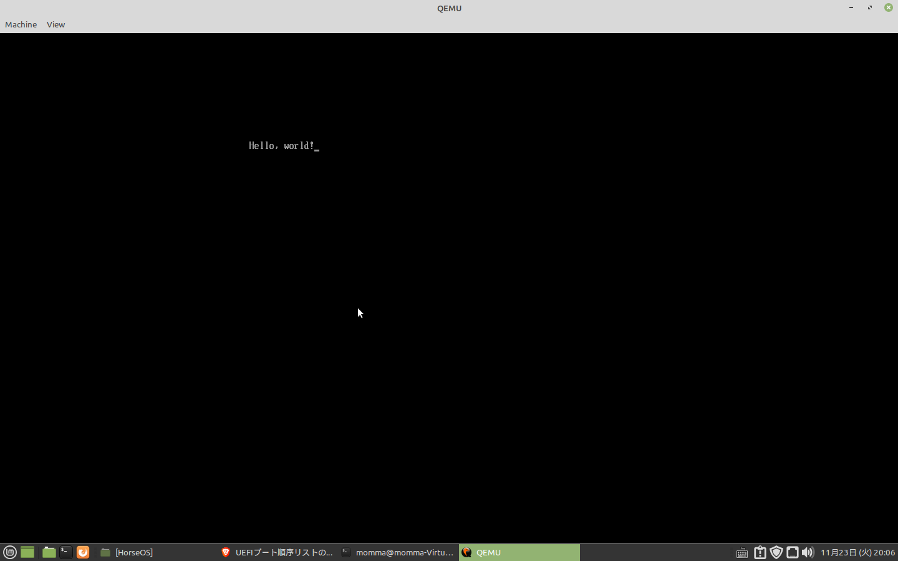
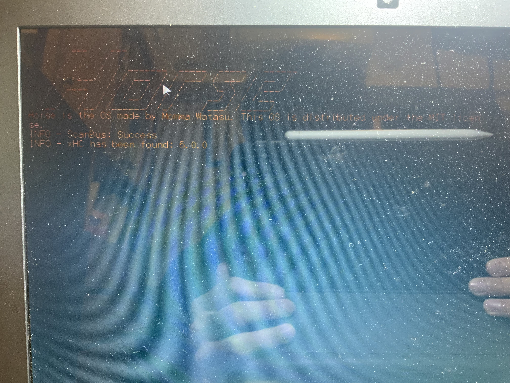
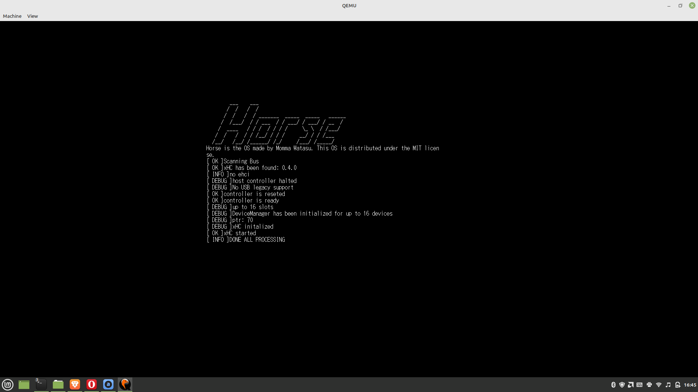
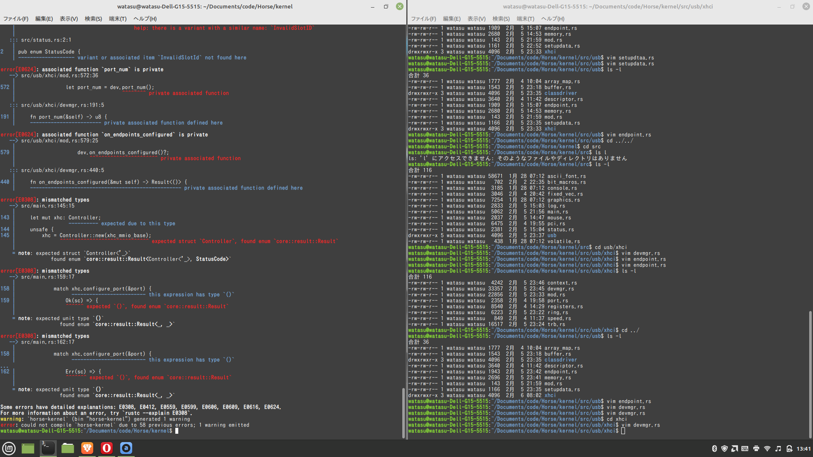

# マウスを動かすまで
Mikan本持ってない方でもわかるようHello Worldは書いておきます。

まず、「OSを作る」と言われても、どう動くものかイメージがつかないとやってられないと思います。大雑把な流れとしては、
- BIOSがIPL(Initial Program Loader)を呼び出す。こいつはUSBメモリの中の`/EFI/BOOT/BOOTX64.efi`であることになってる。
- IPLがUEFIのboot service(標準出力などを一時的に提供してくれる)を使ってメモリマップの書き込みを行う
- IPLからカーネルを呼び出す。このときUEFIは邪魔にならないよう切っておく。
- カーネルが動き始める。
といった感じです。Hello Worldやったあとは、ちょっと長くなる（そしてIntelのおじさんが決めたからシリーズ）ので、マウスを動かすまで若干省きます。

## Hello World
### 準備
Hello Worldするのにも準備が必要です（なんだかんだここが一番つまんない気がします）。
まず、Rustの最新バージョンを使う必要があるので、`rustup default nightly`しておきます。
そして、リンクにLLVMが後々必要になるので入れちゃいます。
```
$ sudo apt install lld
```

テスト環境としてQEMUを使いたいので、インストールします。
```
$ sudo apt install qemu
$ sudo apt install qemu-utils
$ sudo apt install qemu-system-x86
```
更に、QEMUを動かすのにOVFMなるファイルが必要になるのですが、面倒くさいので僕のリポジトリの`/dev-tools`から持ってきてください（両方です）。

また、Rustも発達途中で、いろいろエラーが出るかもしれませんが、そのときはコンパイラの`note`やら`help`を見ましょう。Rustのコンパイラは本当に親切です。

### IPL
準備は先ほどしたんですが、Cargoの設定はまだ残っています。
まずプロジェクトを作って
```
$ cargo new [ブートローダのプロジェクト名] -bin
```
Cargo.tomlをこんな感じに（適宜読み変えてください）します。
```
[package]
name = "horse-bootloader"
version = "0.1.0"
edition = "2021"

# See more keys and their definitions at https://doc.rust-lang.org/cargo/reference/manifest.html

[dependencies]
uefi = { version = "0.10.0", features = ["exts", "alloc", "logger"] }
log = { version = "0.4.11", default-features = false }
elf_rs = "0.1"
```
更に`.cargo/config.toml`をこんな感じで
```
[build]
target = "x86_64-unknown-uefi"

[unstable]
build-std = ["core", "alloc", "compiler_builtins"]
build-std-features = ["compiler-builtins-mem"]
```
これでやっと本題です。IPLのプログラム(`src/main.rs`)をこんな感じで書いてください
```
#![feature(abi_efiapi)]
#![feature(alloc_error_handler)]
#![no_std]
#![no_main]

#[macro_use]
extern crate alloc;
use alloc::string::ToString;
use core::arch::asm;
use console::gop;
use log;
use core::fmt::Write;
use elf_rs::*;
use proto::console;
use uefi::{
    prelude::*,
    proto::{self, console::gop::GraphicsOutput, media::fs::SimpleFileSystem},
    table::boot::{EventType, MemoryDescriptor, Tpl},
};
use uefi::{
    proto::media::file::{File, FileAttribute, FileInfo, FileMode, FileType::Regular},
    table::boot::{AllocateType, MemoryType},
};

static mut LOGGER: Option<uefi::logger::Logger> = None

#[entry]
fn efi_main(handle: Handle, st: SystemTable<Boot>) -> Status {
    let bt = st.boot_services();
    let stdout = st.stdout();
    
    writeln!(stdout, "booting HorseOS...").unwrap();
}
```
これで
```
$ cargo build
```
して、`target/x86_64-unkown-uefi/debug`からEFIファイルを持ってきます。
ここから黙々とコマンドを叩いていけばHello Worldと出会えるはず。。。（だめだったらここは他のサイト見てください、だいぶ立ってから書いてるので記憶が薄れてるので）
```
$ qemu-img create -f raw disk.iso 200M
$ mkfs.fat -n 'HORSE OS' -s 2 -f 2 -R 32 -F 32
$ mkdir -p mnt
$ sudo mount -o loop disk.iso mnt
$ sudo mkdir -p mnt/EFI/BOOT
$ sudo cp bootloader.efi  mnt/EFI/BOOT/BOOTX64.EFI
$ sudo umount mnt
$ qemu-system-x86_64 \
    -m 1G \
    -drive if=pflash,format=raw,readonly,file=./dev-tools/OVMF/OVMF_CODE.fd \
    -drive if=pflash,format=raw,file=./dev-tools/OVMF/OVMF_VARS.fd \
    -drive if=ide,index=0,media=disk,format=raw,file=disk.iso \
    -device nec-usb-xhci,id=xhci \
    -device usb-mouse -device usb-kbd \
    -monitor stdio \
```
ふう、こんな画面が見えましたか？

まあ、ここは感動するための手続きみたいなもんなので、駄目なら駄目でさっさと次に進んでしまいましょう。
なお、僕のようにお馬鹿な人ばかりではないと思いますが、QEMUの画面でマウスをキャプチャして「抜け出せない！」などとならないようにしましょう、ダサすぎるので。Windowのタイトルに書いてありますが、`Ctrl+Alt+G`で抜けられます。

## カーネルを呼び出してみよう
面倒くさいのでIPLの詳細は省きます。興味のある人はコードを読んだり他のサイトを探してください（カーネル本体書き始めるまではほんとにやるだけです）。
というわけでIPLを[僕のリポジトリ](https://github.com/MommaWatasu/Horse/blob/master/bootloader/src/main.rs)から引っ張って来て、魔改造してあげましょう。

そして、カーネルのテンプレも作りましょう（OSの名前はよく考えましょう、愛着の湧くように）。
```
$ cargo new [OSの名前] -bin
```
そして、カーネルのビルドはIPLよりひと手間増えます。僕のリポジトリから[ターゲットファイル](https://github.com/MommaWatasu/Horse/blob/master/kernel/x86_64-unknown-none-horsekernel.json)を取って来て、プロジェクト直下に置いといてください。
そしてCargo.tomlを
```
[package]
name = "horse-kernel"
version = "0.1.0"
edition = "2021"

# See more keys and their definitions at https://doc.rust-lang.org/cargo/reference/manifest.html

[dependencies]
x86_64 = "0.14.1"
spin = { version = "0.9.0", features = ["lock_api", "mutex"] }

[profile.dev]
panic="abort"
```
`.cargo/config.toml`を
```
[build]
target = "x86_64-unknown-none-horsekernel.json"

[unstable]
build-std = ["core", "compiler_builtins"]
build-std-features = ["compiler-builtins-mem"]
```
こうして準備完了です。`src/main.rs`にカーネルの土台を書きます。
```
#![no_std]
#![no_main]
#![feature(abi_efiapi)]

#[no_mangle]
extern "sysv64" fn kernel_main(fb: *mut FrameBuffer, mi: *mut ModeInfo) -> ! {
    loop {
        unsafe {
            asm!("hlt")
        }
    }
}
```
とりあえずCPUを休ませるだけですが、ひとつだけ説明する必要があるのは、`extern "sysv64"`ですが、Rustでプログラムを書くと、余計な情報がついてしまうようで、そのままだとIPLが上手くこの関数を呼び出せません、そこで、Cのように不要なものの内容にするために指定しています。
このあとプログラムを読めば解ると思いますが、ところどころCに合わせるために細工がされています。

## マウスを動かそう
マウスを動かすまでにいろいろあるんですが、こういう技術的な解説を書こうとするとまさにMikan本のようなものすごく長いものになってしまうので、大幅カットで一気にマウスを動かすところまで行きます。
で、ちょっとこっから先はコードが長いので、GitHubからcloneしてください。
```
$ git clone https://github.com/MommaWatasu/Horse.git
```
そして、マウスを動かすためにチェックアウトします。
```
$ git checkout ba6648e
```
だいぶいろいろ追加されてますが、だいたいこんなものが追加されてます。
- dev-tools: ビルド関係のファイル
- Makefile.toml: Cargo-makeの設定ファイル、こいつのおかげであの冗長なコマンドを打たなくて済む。入れてない人はCargo-makeを入れておきましょう。
- kernel: カーネルとその他愉快な仲間たち(usbディレクトリにUSB ホストドライバが入ってます。)
説明が面倒くさいのでこれ以上の説明はしませんが、なんとなく一度コードを眺めて何をしているのかぐらいは見ておいた方がいいと思います。僕も他の方のコードを眺めて大体関係性をりかいしたので。ファイル名から何やってるか察する事も多いと思いますしね。

さて、皆さんお待ちかねのマウス君とキーボード君の登場です。
```
$ makers RUN
```
するとあら不思議、マウスがちゃんと動き、キーボードも入力した文字が表示されるではありませんか！
[Mouse and Keyboard](https://github.com/MommaWatasu/Blog/blob/master/src/assets/Horse-4.mp4)
これは感動しましたよ。こういうの見ると、開発し続けるやる気が湧いてきます。
ただ、お気づきかと思いますが、マウスが端に寄せたときに隠れないなどの不自然なところはありますが、このへんは少し面倒なので後回し。

## おまけ
実機で動かしているの図、古いパソコンと古いUSBがあったらぜひやってみてください、LinuxのUSBライタでdisk.isoを書き込んで、BIOSでセキュアブートをオフにした上で起動順位さえ変えれば簡単にできます。


XHCIの設定周りのテストをしているの図、この辺はMikan本を読みながらやれるといいです。


ビルドのビフォーアフター、僕はホストドライバをmandarinOSという他の方が書いたものから取ってきたんですが（先人は偉大）、これの写経をしていて、大量のバグが出ました。前と後のスクロールバーの大きさでわかるかと思います。。。みなさんもOS作りをするときは無理そうならコピペしましょう。
